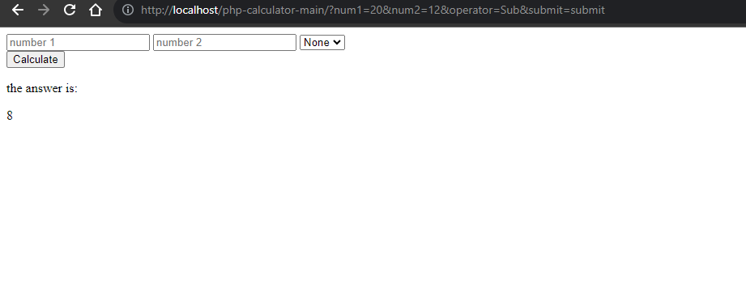

# Simple PHP Calculator Web Application



This repository contains a simple web application for a calculator implemented using PHP. The application allows users to perform basic arithmetic calculations, such as addition, subtraction, multiplication, and division. It is designed to be run on a server environment like XAMPP, making it easy to set up and use.

## Installation and Setup

To run this PHP calculator web application on your local server (e.g., XAMPP), follow the steps below:

1. **Clone the repository:**
```
git clone https://github.com/mbilal-x/php-calculator.git
```

2. **Configure Your Server:**

- Ensure you have XAMPP or a similar server environment installed on your computer.
- Copy the repository folder (`php-calculator`) into the appropriate server directory (e.g., `htdocs` for XAMPP).

3. **Start the Server:**

- Start your XAMPP server or any other server you're using.

4. **Access the Application:**

- Open your web browser and visit: `http://localhost/php-calculator`


## Features

- Basic arithmetic operations: addition, subtraction, multiplication, and division.
- User-friendly interface for ease of use.
- Real-time calculation and result display.

